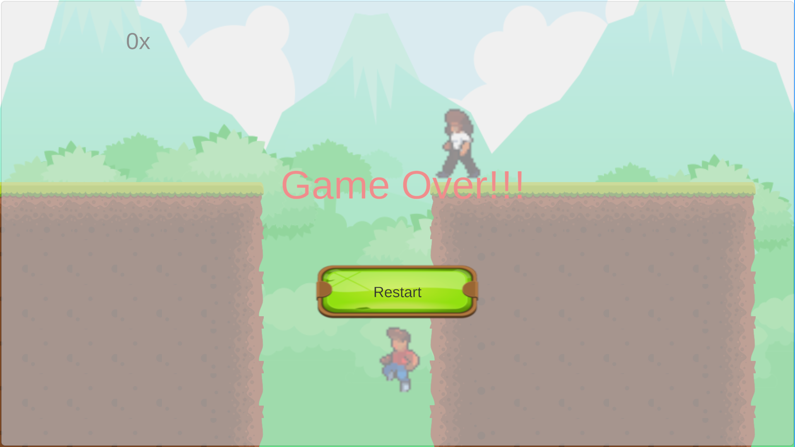
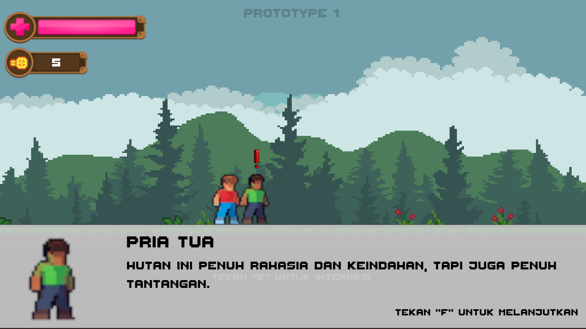

# 🎮 Petualangan Si Merah

**Petualangan Si Merah** adalah game platformer 2D yang bisa dimainkan langsung di browser (WebGL). Dikembangkan dengan Unity, game ini menghadirkan perjalanan seru seorang karakter bernama "Si Merah" dalam menaklukkan berbagai rintangan dan berinteraksi dengan lingkungan sekitarnya.

---

## 🚀 Cara Main

1. Buka game di browser melalui link WebGL [🔗 Link Game](#-link-game)).
2. Gunakan tombol arah (← →) atau A dan D untuk bergerak.
3. Tekan **Space** untuk melompat.
4. Tekan **E** untuk berinteraksi dengan NPC atau objek tertentu.
5. Hati-hati dengan musuh dan jebakan!

---

## 🧩 Fitur-Fitur

- 🎮 Kontrol gerakan & lompat
- 💬 Sistem interaksi NPC
- ❤️ Sistem nyawa (Health)
- 🧠 UI Dialog dan Pause Menu
- 🔫 Mekanisme serangan & peluru
- 🛑 Game Over dan Restart
- ⚙️ Dibuat dengan Unity Engine
- 🌐 WebGL support — main langsung tanpa install

---

## 📷 Screenshot

---

## 👨‍💻 Tentang Pembuat

Game ini dibuat oleh **Fathir**, seorang pelajar SMK yang sedang belajar Unity dan pembuatan game 2D. Proyek ini dibuat sebagai sarana latihan dan eksplorasi terhadap dunia game development.  
Terima kasih sudah mencoba game ini — semoga menyenangkan!

---

## 🔗 Link Game

> 🎮 [Mainkan di browser via WebGL](https://sipatirrr.github.io/GameJadi/)

---

## 📂 Bahasa & Alat yang Digunakan

- Unity 2D
- C# scripting
- WebGL Build
- Visual Studio Code
- Git & GitHub

---

## 📬 Kontak

📧 Email: hibatullahfathir12@gmail.com 
📸 Instagram: [@fathir.hbtlh](https://instagram.com/fathir.hbtlh).

---

## 📄 License

-
